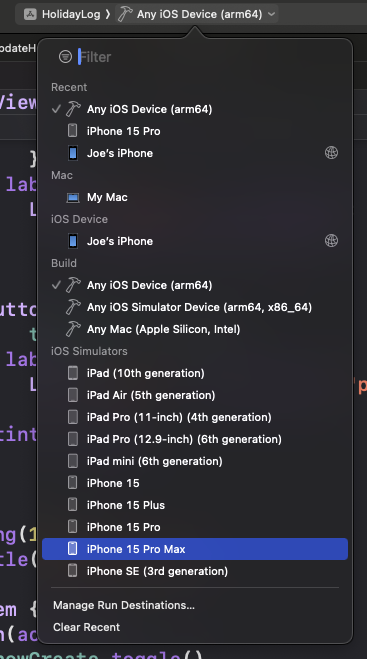
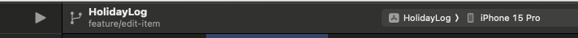

# HolidayLog

An iOS app to track your trips so you never forget where you've been or where you're going.

## Setup
MacOS is required to clone this repo and run the app locally. You will also need an Apple ID.

### Required Software

To run the project, you need Xcode which can be downloaded from the App Store, or from [here](https://developer.apple.com/download/applications/) - this offers better version control of Xcode but the choice is yours. An Apple Developer account is required to download this way, but it's free to enroll in with your Apple ID.

When Xcode has downloaded, launch Xcode from Applications (or wherever you saved it), accept any T&Cs thrown your way and when prompted download the iOS SDK so that iOS simulators can be run. 

## Running the app

This section assumes you have Xcode installed and have cloned this repo. 

With the project open in Xcode, at the top ensure you have an iOS device selected from the dropdown list here:

To run the app click the play button on the right-hand side of Xcode:

